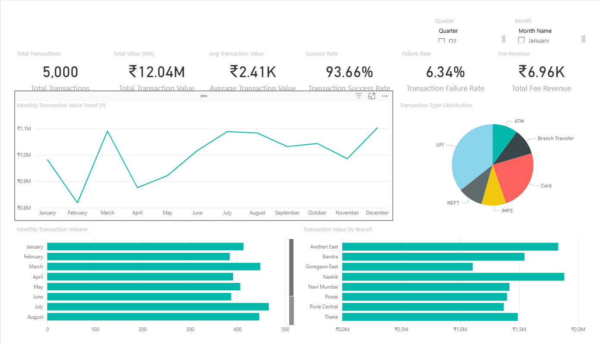
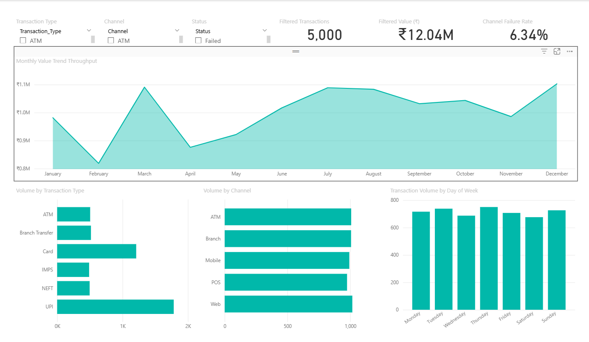
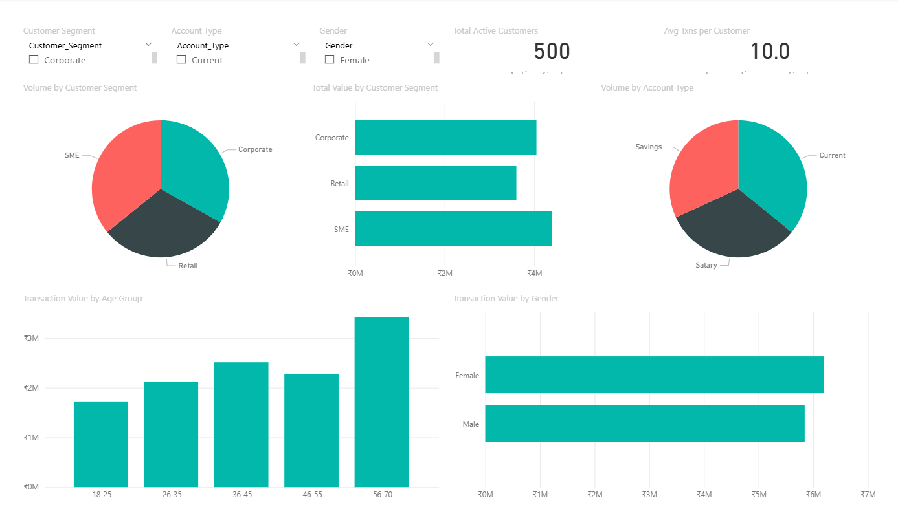
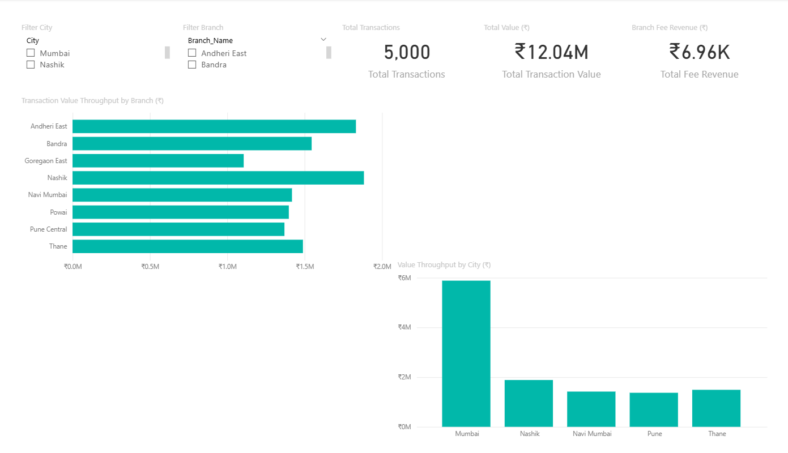

# Banking Transaction Analytics

## Project Overview

This project is an end-to-end Data Analyst portfolio project built using a synthetic banking dataset containing **5,000 transactions, 500 customers, and 8 branches**.

The objective is to analyze transaction activity, customer behavior, branch performance, payment channels, transaction failures, and fee revenue using **SQL and Power BI**.

The project demonstrates practical skills in data validation, SQL analysis, dimensional modeling, DAX, KPI reporting, interactive dashboard development, and business insight generation.

---

## Business Problem

A retail bank needs a centralized analytical view of transaction performance, customer activity, branch performance, channel usage, failed transactions, and fee revenue.

The analysis aims to help management:

- Identify transaction volume and value trends
- Monitor key business KPIs
- Compare branch performance
- Understand customer segments and transaction behavior
- Investigate transaction failures
- Analyze payment channels and transaction types
- Generate actionable business insights

---

## Dataset

This project uses a **synthetic banking dataset** created for portfolio and learning purposes.

### Dataset Summary

- **5,000** transactions
- **500** customers
- **8** branches
- **6** transaction types
- **5** transaction channels
- Transaction period: **January 2025 – December 2025**

### Main Tables

- `Transactions`
- `Customers`
- `Branches`

The CSV datasets used in the project are available inside the `data/` folder.

---

## Tools & Technologies

- **SQL Server / T-SQL** — Data validation and business analysis
- **Power BI Desktop** — Data modeling and dashboard development
- **DAX** — KPI and analytical measure creation
- **Power Query** — Data loading and transformation
- **Excel / CSV** — Source data
- **Git & GitHub** — Version control and project documentation

---

## Data Cleaning & Validation

SQL was used to perform data-quality checks before analysis, including:

- Missing-value checks
- Duplicate-record checks
- Primary-key validation
- Referential-integrity checks
- Transaction-value validation
- Date validation
- Business-rule validation

The complete validation script is available at:

`sql/data_cleaning.sql`

---

## SQL Analysis

SQL was used to analyze:

- Overall transaction KPIs
- Monthly transaction trends
- Month-over-month growth
- Transaction types
- Transaction channels
- Transaction failure rates
- Branch performance
- Customer segments
- Fee revenue
- Customer activity
- Day-of-week patterns
- Quarterly performance
- Age-group analysis
- High-value transactions

The analysis demonstrates SQL concepts including:

- `JOIN`
- `GROUP BY`
- `CASE`
- Common Table Expressions (CTEs)
- Subqueries
- Aggregate functions
- Window functions such as `LAG()` and `RANK()`

The complete business analysis is available at:

`sql/business_analysis.sql`

---

## Power BI Data Model

The Power BI solution uses a **star-schema data model** to organize transaction data for reporting and analysis.

### Fact Table

- `Fact_Transactions`

### Dimension Tables

- `Dim_Customers`
- `Dim_Branches`
- `Dim_Date`

A dedicated `_Measures` table is used to organize analytical DAX measures.

Additional model documentation is available at:

`powerbi/powerbi_data_model.md`

---

## DAX Measures

The Power BI report includes measures for:

- Total Transactions
- Total Transaction Value
- Average Transaction Value
- Successful Transactions
- Failed Transactions
- Transaction Success Rate
- Transaction Failure Rate
- Active Customers
- Transactions per Customer
- Total Fee Revenue
- Previous Month Transactions
- Previous Month Transaction Value
- Month-over-Month Transaction Growth
- Month-over-Month Transaction Value Growth

DAX documentation is available at:

`powerbi/dax_measures.md`

---

## Key KPIs

| KPI | Result |
|---|---:|
| Total Transactions | 5,000 |
| Total Transaction Value | ₹12.04M |
| Average Transaction Value | ₹2.41K |
| Transaction Success Rate | 93.66% |
| Transaction Failure Rate | 6.34% |
| Active Customers | 500 |
| Total Fee Revenue | ₹6.96K |

---

## Power BI Dashboard

The Power BI report contains **four interactive dashboard pages** with slicers and cross-filtering for exploring transaction, customer, and branch performance.

### 1. Executive Overview

Provides a high-level view of transaction KPIs, monthly transaction-value trends, transaction types, and branch performance.



### 2. Transaction Analysis

Analyzes transaction activity by transaction type, channel, status, month, and day of week.



### 3. Customer Analysis

Analyzes customer activity by customer segment, account type, age group, and gender.



### 4. Branch Performance

Compares transaction volume, transaction value, and fee revenue across branches and cities.



---

## Key Insights

- The dataset contains **5,000 transactions** with a combined transaction value of approximately **₹12.04 million**.
- The overall transaction success rate is **93.66%**, while the failure rate is **6.34%**.
- **UPI** represents the largest share of transactions by transaction type.
- **Mobile** transactions show the highest channel failure rate and may require further investigation.
- **Nashik** records the highest branch-level transaction activity.
- Customer transaction activity varies across customer segments, account types, age groups, and gender.

---

## Business Recommendations

- Investigate the factors contributing to higher-performing branches to determine whether useful practices or customer-mix patterns can be replicated.
- Review transaction channels with higher failure rates to identify potential operational or technical causes.
- Monitor transaction trends over time to identify unusual changes in transaction volume or value.
- Use customer-segment analysis to better understand high-activity and high-value customer groups.
- Continue monitoring transaction-quality and operational KPIs through recurring reporting.

More detailed observations and recommendations are available in:

`business_insights.md`

---

## Project Structure

```text
Banking-Transaction-Analytics/
│
├── data/
│   ├── Branches.csv
│   ├── Customers.csv
│   └── Transactions.csv
│
├── sql/
│   ├── database_setup.sql
│   ├── data_cleaning.sql
│   └── business_analysis.sql
│
├── powerbi/
│   ├── Banking_Analytics.pbip
│   │
│   ├── Banking_Analytics.Report/
│   │   ├── definition.pbir
│   │   ├── report.json
│   │   └── .platform
│   │
│   ├── Banking_Analytics.SemanticModel/
│   │   ├── .platform
│   │   ├── definition.pbism
│   │   ├── diagramLayout.json
│   │   └── model.bim
│   │
│   ├── dax_measures.md
│   └── powerbi_data_model.md
│
├── screenshots/
│   ├── executive_overview.png
│   ├── transaction_analysis.png
│   ├── customer_analysis.png
│   └── branch_performance.png
│
├── business_insights.md
├── README.md
└── .gitignore
```

---

## How to Open the Power BI Project

1. Clone or download this repository.
2. Open the `powerbi/` folder.
3. Open `Banking_Analytics.pbip` using **Power BI Desktop**.
4. If Power BI cannot locate the source CSV files, update the data-source paths to point to the corresponding files inside the local `data/` folder.
5. Refresh the report.

### Data Source Note

The Power BI project currently references local CSV file paths from the original development environment.

When opening the project on another computer, the data-source paths may need to be updated in Power BI to point to the CSV files provided in this repository's `data/` folder.

---

## What This Project Demonstrates

- SQL-based data cleaning and validation
- Exploratory and business data analysis
- SQL joins, CTEs, CASE statements, subqueries, aggregations, and window functions
- Star-schema data modeling
- Power Query data preparation
- DAX measure development
- KPI design and reporting
- Interactive Power BI dashboard development
- Customer, transaction, and branch performance analysis
- Translation of analytical findings into business recommendations

---

## Author

**Sarvadeep Singh**  
B.Sc. Data Science  
Mumbai, Maharashtra

**GitHub:** github.com/sarvadeepsingh89-web  
**LinkedIn:** linkedin.com/in/sarvadeep-singh