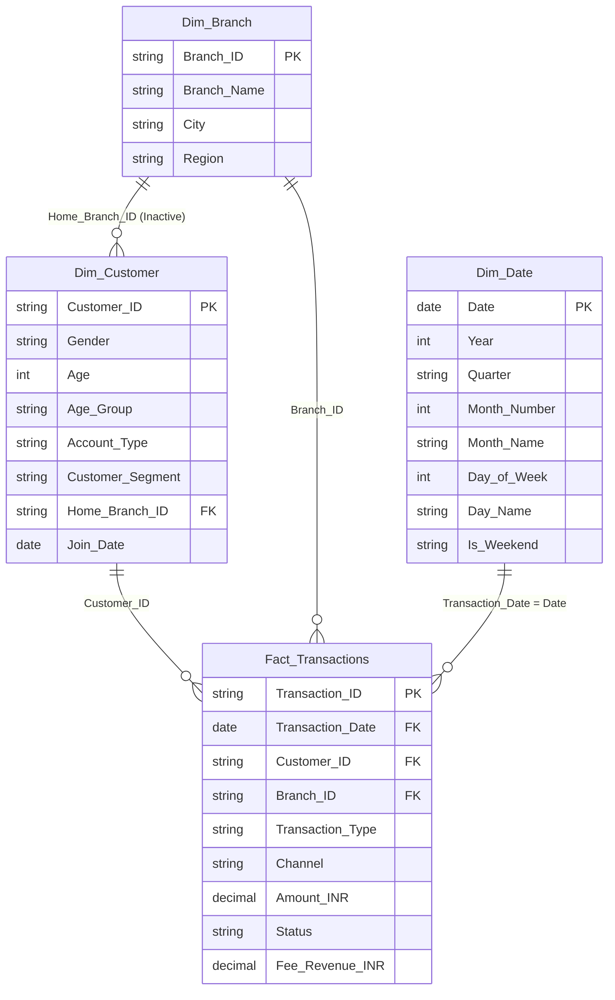

# Power BI Data Model Specification

This document outlines the data model, import procedures, and transformations required to build the Banking Transaction Analytics Power BI project.

---

## 1. Data Import Instructions

1. Open **Power BI Desktop** and create a new blank report.
2. On the **Home** ribbon, click **Get Data** → **Excel Workbook**.
3. Navigate to the `data/` directory and select `Banking_Transactions.xlsx`. In the Navigator, check **Transactions** and click **Transform Data**.
4. Repeat for `Banking_Customers.xlsx` (select **Customers**) and `Banking_Branches.xlsx` (select **Branches**).
5. All three tables should now appear in the **Power Query Editor**.

---

## 2. Data Transformations in Power Query

### 2.1 Table Renaming
In the Power Query Editor, right-click each table name on the left panel and rename:
- `Transactions` → **`Fact_Transactions`**
- `Customers` → **`Dim_Customer`**
- `Branches` → **`Dim_Branch`**

### 2.2 Date Type Conversions

The date columns (`Transaction_Date` and `Join_Date`) are stored as Excel serial integer numbers. Convert them to proper dates:

**For `Transaction_Date` in Fact_Transactions:**
1. Select the `Transaction_Date` column.
2. Go to **Add Column** → **Custom Column**.
3. Name: `Transaction_Date_Converted`
4. Formula: `= Date.AddDays(#date(1899, 12, 30), [Transaction_Date])`
5. Set the new column data type to **Date**.
6. Delete the original `Transaction_Date` column.
7. Rename `Transaction_Date_Converted` to `Transaction_Date`.

**For `Join_Date` in Dim_Customer:**
1. Select the `Join_Date` column.
2. Go to **Add Column** → **Custom Column**.
3. Name: `Join_Date_Converted`
4. Formula: `= Date.AddDays(#date(1899, 12, 30), [Join_Date])`
5. Set the new column data type to **Date**.
6. Delete the original `Join_Date` column.
7. Rename `Join_Date_Converted` to `Join_Date`.

> **Alternative:** If Power Query auto-converts the integer to a date when you change the data type to Date, you can skip the custom column step. Test by selecting the column → Transform → Data Type → Date.

### 2.3 Verify Data Types

Confirm these data types in Power Query:

| Table | Column | Data Type |
|-------|--------|-----------|
| Fact_Transactions | Transaction_ID | Text |
| Fact_Transactions | Transaction_Date | Date |
| Fact_Transactions | Customer_ID | Text |
| Fact_Transactions | Branch_ID | Text |
| Fact_Transactions | Transaction_Type | Text |
| Fact_Transactions | Channel | Text |
| Fact_Transactions | Amount_INR | Decimal Number |
| Fact_Transactions | Status | Text |
| Fact_Transactions | Fee_Revenue_INR | Decimal Number |
| Dim_Customer | Customer_ID | Text |
| Dim_Customer | Gender | Text |
| Dim_Customer | Age | Whole Number |
| Dim_Customer | Account_Type | Text |
| Dim_Customer | Customer_Segment | Text |
| Dim_Customer | Home_Branch_ID | Text |
| Dim_Customer | Join_Date | Date |
| Dim_Branch | Branch_ID | Text |
| Dim_Branch | Branch_Name | Text |
| Dim_Branch | City | Text |
| Dim_Branch | Region | Text |

### 2.4 Add Age Group Column (Dim_Customer)

1. Select the `Dim_Customer` table in Power Query.
2. Go to **Add Column** → **Conditional Column**.
3. Name: `Age_Group`
4. Add the following conditions:

| Condition | Output |
|-----------|--------|
| If `Age` is less than or equal to `25` | `18-25` |
| Else if `Age` is less than or equal to `35` | `26-35` |
| Else if `Age` is less than or equal to `45` | `36-45` |
| Else if `Age` is less than or equal to `55` | `46-55` |
| Else | `56-70` |

5. Set the new column data type to **Text**.

### 2.5 Close & Apply
Click **Close & Apply** on the Home ribbon to load all transformed tables into the Power BI model.

---

## 3. Calendar/Date Table Creation (DAX)

After loading data, create a date dimension table:

1. Go to the **Modeling** tab → click **New Table**.
2. Paste the following DAX:

```dax
Dim_Date = 
ADDCOLUMNS (
    CALENDAR (DATE(2025, 1, 1), DATE(2025, 12, 31)),
    "Year", YEAR([Date]),
    "Quarter", "Q" & FORMAT([Date], "Q"),
    "Quarter Number", QUARTER([Date]),
    "Month Number", MONTH([Date]),
    "Month Name", FORMAT([Date], "MMMM"),
    "Month Short", FORMAT([Date], "MMM"),
    "Day of Month", DAY([Date]),
    "Day of Week", WEEKDAY([Date], 2),
    "Day Name", FORMAT([Date], "DDDD"),
    "Is Weekend", IF(WEEKDAY([Date], 2) >= 6, "Yes", "No")
)
```

3. **Mark as Date Table**: Right-click `Dim_Date` in the Fields pane → **Mark as date table** → Select `Date` as the date column.

---

## 4. Star Schema Design

The model follows a classic **star schema** with one fact table at the center and three dimension tables:



---

## 5. Relationship Table

| # | From Table | From Column | To Table | To Column | Cardinality | Cross-Filter Direction | Active |
|---|-----------|-------------|----------|-----------|-------------|----------------------|--------|
| 1 | Dim_Customer | Customer_ID | Fact_Transactions | Customer_ID | One-to-Many (1:*) | Single | ✅ Yes |
| 2 | Dim_Branch | Branch_ID | Fact_Transactions | Branch_ID | One-to-Many (1:*) | Single | ✅ Yes |
| 3 | Dim_Date | Date | Fact_Transactions | Transaction_Date | One-to-Many (1:*) | Single | ✅ Yes |
| 4 | Dim_Branch | Branch_ID | Dim_Customer | Home_Branch_ID | One-to-Many (1:*) | Single | ❌ No (Inactive) |

---

## 6. Step-by-Step Relationship Creation

1. In Power BI Desktop, switch to the **Model view** (icon on the left sidebar).
2. Click **Manage Relationships** on the Home ribbon → **New**.

### Relationship 1: Customer → Transactions
- **From**: `Dim_Customer` → `Customer_ID`
- **To**: `Fact_Transactions` → `Customer_ID`
- Cardinality: **One to Many (1:*)**
- Cross-filter direction: **Single**
- Check **Make this relationship active** ✅
- Click **OK**

### Relationship 2: Branch → Transactions
- **From**: `Dim_Branch` → `Branch_ID`
- **To**: `Fact_Transactions` → `Branch_ID`
- Cardinality: **One to Many (1:*)**
- Cross-filter direction: **Single**
- Check **Make this relationship active** ✅
- Click **OK**

### Relationship 3: Date → Transactions
- **From**: `Dim_Date` → `Date`
- **To**: `Fact_Transactions` → `Transaction_Date`
- Cardinality: **One to Many (1:*)**
- Cross-filter direction: **Single**
- Check **Make this relationship active** ✅
- Click **OK**

### Relationship 4: Branch → Customer (Inactive)
- **From**: `Dim_Branch` → `Branch_ID`
- **To**: `Dim_Customer` → `Home_Branch_ID`
- Cardinality: **One to Many (1:*)**
- Cross-filter direction: **Single**
- **Uncheck** Make this relationship active ❌ (this is an inactive relationship)
- Click **OK**

> **Why inactive?** The Branch dimension already connects to Fact_Transactions via Branch_ID. The Home_Branch_ID relationship is kept inactive to avoid ambiguity. Use `USERELATIONSHIP()` in DAX if you need to analyze customers by their home branch.

---

## 7. Final Model Checklist

- [ ] All 4 tables loaded and renamed correctly
- [ ] Date columns converted from serial integers to Date type
- [ ] Age_Group column added to Dim_Customer
- [ ] Dim_Date calendar table created via DAX
- [ ] Dim_Date marked as Date table
- [ ] All 4 relationships created with correct cardinality
- [ ] Relationship 4 (Branch → Customer) set to Inactive
- [ ] All cross-filter directions set to Single
